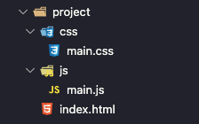
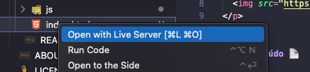

<h1 align="center">
   Estrutura do projeto
</h1>
 
 

 
  

   
 
##  Conteúdo 📄
 
1.  [Visão geral do curso ](../part1/README.md)
    * Qual a finalidade do curso?
    * O que é preciso para fazer o curso?
1.  [Estrutura do projeto ⬅️](README.md)
    *   Template básico com html, css, e JavaScript 
1.  [Aprendendo a desenhar na tela](https://www.google.com)
    *  Serão criado uma lib simples para desenhar formas geométricas(linha,circulo, retangulo..) 
1.  [ Criando uma classe de Log(console.log)](https://www.google.com)
1.  [ Implementando um Jogador com movimentos ](https://www.google.com)
1.  [ Adicionando o loop do jogo](https://www.google.com)
    *  Aprendendo sobre fps 
1.  [ Adicionar habilidade de atirar ao jogador](https://www.google.com)
1.  [ Criar inimigos com vida( em %)](https://www.google.com)
1.  [ Adicionar vida ao jogador(em %)](https://www.google.com)
1.  [ Implementar GUI(textos,botoes,....)](https://www.google.com)
1.  [ Criando uma maquina de estado básica](https://www.google.com)
    * Controlar os estados, Inicio, Jogar,Jogando,Pausa e GameOver 
1.  [Sobre o Autor ](../ABOUT.md)

---

##  Criando um template básico em html, css e JavaScript 🏭

 
 
  Arquivos inicais criados iniciar o projeto.
 

 
 ---

 ##  Como rodar o programa 🖥️

Abra o arquivo index.html com qualquer browser, ou use o plugin abaixo no VsCode.
 
 
 

  No VsCode clique sobre o arquivo index.html e rode usando o  [ Open Live Server](https://marketplace.visualstudio.com/items?itemName=ritwickdey.LiveServer)
 

