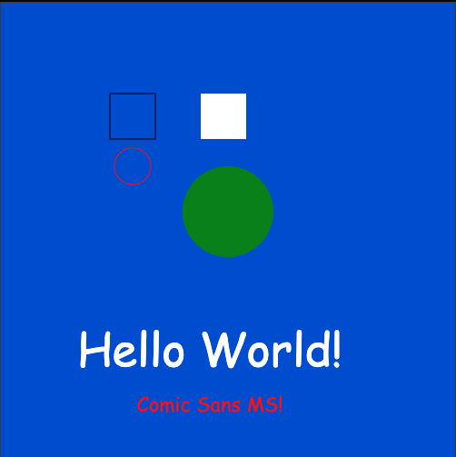
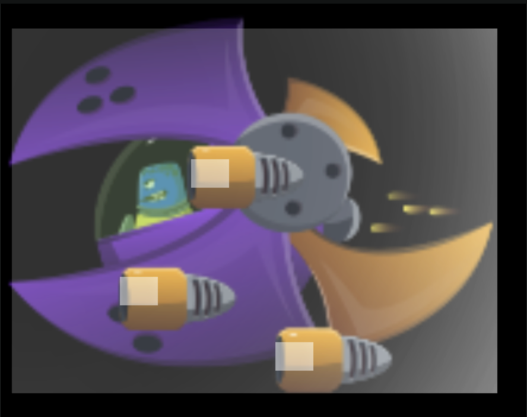

<h1 align="center">
   3 - Aprendendo a desenhar na tela
</h1>
 
 

 
  

   
 
##  Conteúdo 📄
 
1.  [Visão geral do curso ](https://github.com/dedogames/curso_space_2d_js/tree/main/part1)
    * Qual a finalidade do curso?
    * Requisitos tecnologicos para rodar/desenvolver o jogo
    * Requisitos técnicos recomendável, mas não obrigatórios
2.  [Estrutura do projeto](https://github.com/dedogames/curso_space_2d_js/tree/main/part2)
    *   Template básico com html, css, e JavaScript 
3.  [Aprendendo a desenhar na tela  ](https://github.com/dedogames/curso_space_2d_js/tree/main/part3)
    *  Qual a importancia de desenhar figuras na tela?
    *  <b>Extra</b>: Criado uma simples classe de log para abstrair o <i>console.log</i>
4.  [ Adicionando o loop do jogo](https://github.com/dedogames/curso_space_2d_js/tree/main/part4)
    *  Movimentnado objetos 
5.  [ Criando atirador](https://github.com/dedogames/curso_space_2d_js/tree/main/part5)
    * Jogador com multiplas armas
6.  [ Criar inimigos com vida( em %)](https://github.com/dedogames/curso_space_2d_js/tree/main/part6)
    * Criando inimigos com herança
    * Adicionando tiros aos inimigos
7.  [ Melhorando as funcionaliaddes do jogo](https://github.com/dedogames/curso_space_2d_js/tree/main/part7)
    * Adicionando colisão entre objetos
    * Setando vidas para jogador/Inimigo
8.  [ Implementar GUI(textos,botoes,....)](https://github.com/dedogames/curso_space_2d_js/tree/main/part8)
9.  [ Criando uma maquina de estado básica](https://github.com/dedogames/curso_space_2d_js/tree/main/part9)
    * Controlar os estados, Inicio, Jogar,Jogando,Pausa e GameOver 
10.  [Sobre o Autor ](https://github.com/dedogames/curso_space_2d_js/blob/main/ABOUT.md)
---

## 3.1 Qual a importancia de desenhar figuras na tela?
Na versão do curso completo, ao inserir imagens(sprites, backgrounds,fonts...) é importante validar se os pontos de onde saem as balas estão corretos, ou se  os pontos de colisão estão com os limites corretos, entre outras coisas com isso, é possivel habilitar o mode debug exibindo bolas e quadrados, com isso fica mais facil validar o que já foi feito, e adicionar novas funcionalidades.
Um exemplo abaixo , demonstra essa técnica.

 
  
   Figura de uma nave, contendo 3 retangulos, o maior, que encobre toda a nave, usado para saber os limites para colisão,
    os outros 3 retangulso menores, são para o ponto que irao, sair os projeteis.

