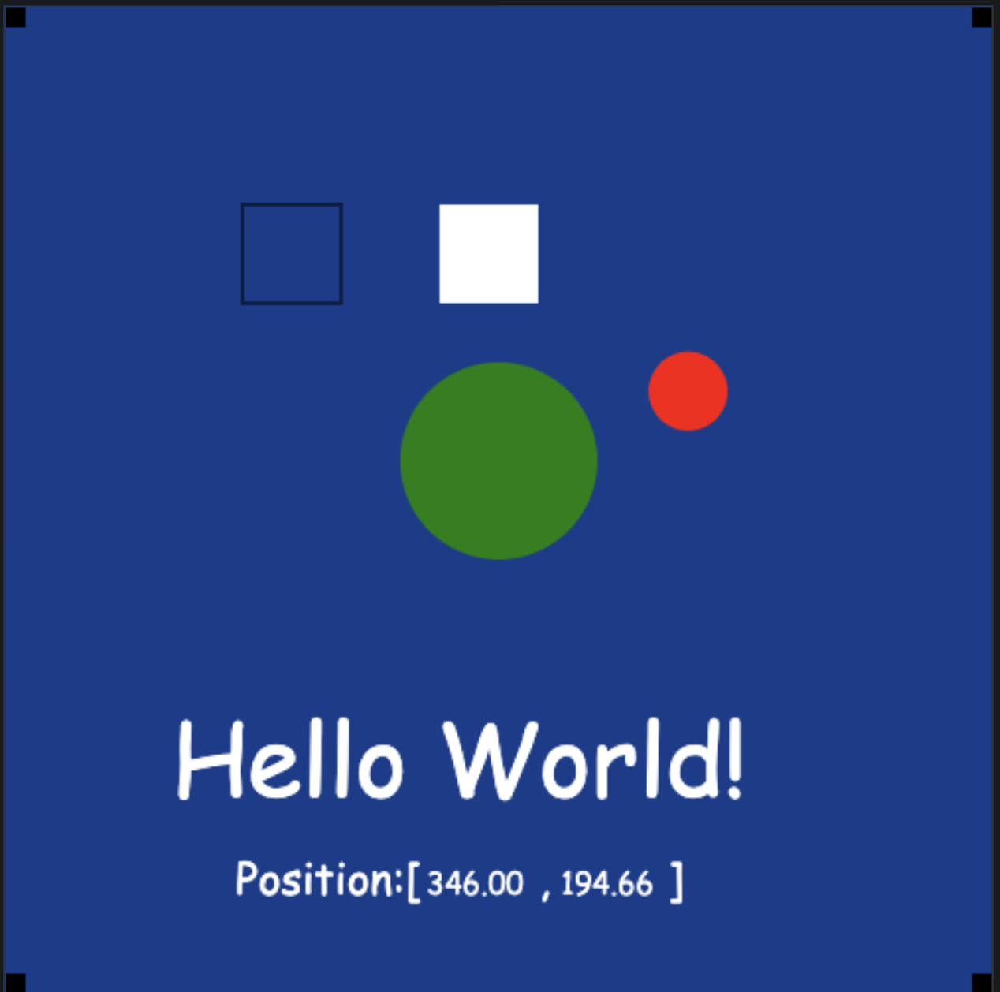

<h1 align="center">
   4 - Adicionando o loop do jogo
</h1>
 
 

 
  
    Movimentando um objeto usando uma função loop com deltaTime

   
 
##  Conteúdo 📄
 
1.  [Visão geral do curso ](../part1)
    * Qual a finalidade do curso?
    * Requisitos tecnologicos para rodar/desenvolver o jogo
    * Requisitos técnicos recomendável, mas não obrigatórios
2.  [Estrutura do projeto](../part2)
    *   Template básico com html, css, e JavaScript 
3.  [Aprendendo a desenhar na tela  ](../part3)
    *  Qual a importancia de desenhar figuras na tela?
    *  <b>Extra</b>: Criado uma simples classe de log para abstrair o <i>console.log</i>
4.  [ Adicionando o loop do jogo](../part4)
    *  Movimentnado objetos
5.  [ Criando atirador](../part5)
    * Jogador com multiplas armas
6.  [ Criar inimigos com vida( em %)](../part6)
    * Criando inimigos com herança
    * Adicionando tiros aos inimigos
7.  [ Adicionar vida ao jogador(em %)](../part7)
    * Adicionando colisão entre objetos
    * Setando vidas para jogador/Inimigo
8.  [ Implementar GUI(textos,botoes,....)](../part8)
9.  [ Criando uma maquina de estado básica](../part9)
    * Controlar os estados, Inicio, Jogar,Jogando,Pausa e GameOver 
10.  [Sobre o Autor ](../ABOUT.md)
---

## 4.1 Movimentnado objetos
Uma parte essencial dos jogos é a aplicação da fisica para movimentar objetos, com isso usamos o conceito de v
Usar como referencia: https://discover.hubpages.com/education/Difference-Between-Speed-and-Velocity

